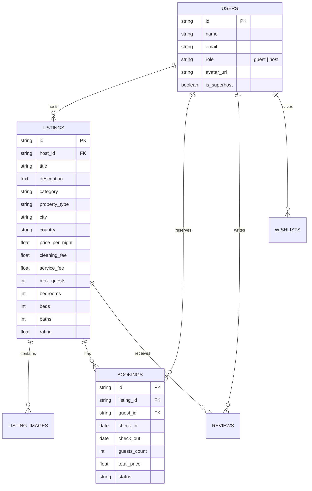

# Airbnb Web Application Clone

A full-stack, functional clone of the Airbnb web application built according to [project_description.txt](file:///c:/Users/thota/Documents/Projects/SCALAR/project_description.txt) and Mobbin design blueprints. Replicates Airbnb's visual design system, user experience, and core browse/search/booking/host CRUD workflows.

---

## 🛠 Tech Stack

- **Frontend**: Next.js 14+ (App Router, TypeScript, React 19), Tailwind CSS, Lucide Icons, date-fns
- **Backend**: Python 3.11+, FastAPI, Uvicorn, SQLAlchemy 2.0 (ORM), Pydantic v2
- **Database**: SQLite 3 (`airbnb.db`) with automated seeder (`python -m app.seed`)

---

## 🚀 Getting Started

### 1. Prerequisites
- Node.js v18+ and `npm`
- Python 3.10+ and `pip`

---

### 2. Backend Setup (FastAPI & SQLite)

1. Navigate to the `backend` directory:
   ```bash
   cd backend
   ```
2. Install Python dependencies:
   ```bash
   pip install -r requirements.txt
   ```
3. Seed the SQLite database with sample listings, hosts, reviews, and bookings:
   ```bash
   python -m app.seed
   ```
4. Start the FastAPI development server:
   ```bash
   python run.py
   ```
   The API server will run at `http://127.0.0.1:8000` (Interactive Swagger docs available at `http://127.0.0.1:8000/docs`).

---

### 3. Frontend Setup (Next.js)

1. Navigate to the `frontend` directory:
   ```bash
   cd frontend
   ```
2. Install Node dependencies:
   ```bash
   npm install
   ```
3. Start the Next.js development server:
   ```bash
   npm run dev
   ```
4. Open [http://localhost:3000](http://localhost:3000) in your browser.

---

## 📊 Database Schema (SQLite)



---

## 🌐 API Overview

| Method | Endpoint | Description |
| :--- | :--- | :--- |
| `GET` | `/api/listings` | Search & filter listings by location, dates, category, price, and guests |
| `GET` | `/api/listings/{id}` | Get listing detail with host info and photo gallery |
| `POST` | `/api/listings` | Host: Create new listing |
| `DELETE` | `/api/listings/{id}` | Host: Delete listing |
| `POST` | `/api/bookings` | Guest: Book stay with date-overlap validation |
| `GET` | `/api/bookings/my-trips` | Guest: Retrieve booked stays |

---

## ✨ Features Implemented

1. **Home & Search**:
   - Header with compact search pill, expanded search modal (Location, Check-in/out dates, Guest counter).
   - Category icon row with active underline filter (`Trending`, `Cabins`, `Tropical`, `Lakefront`, `Iconic`, `Mansions`, `Beachfront`).
   - Filters Modal (Price slider, Property type, Amenities checkboxes).
   - Floating Map Toggle button rendering an interactive map with price pins.
2. **Listing Detail Page (`/rooms/[id]`)**:
   - 5-image collage gallery + full-screen photo viewer modal.
   - Host details, Superhost badges, amenities list, availability calendar, and reviews rating breakdown.
   - Sticky Reservation Sidebar Widget calculating nightly rate × nights + cleaning/service fees.
3. **End-to-End Booking (`/book/[id]` & `/trips`)**:
   - Request to Book checkout page with mock payment options (Card, Apple Pay).
   - Date overlap validation preventing double bookings on the same stay.
   - **My Trips** page listing confirmed bookings with cancellation options.
4. **Host Experience (Full CRUD)**:
   - Header Role Switcher allowing instant toggle between Guest and Host perspectives.
   - Host Dashboard (`/host`) displaying active listings, total revenue analytics, and guest reservations.
   - Host Create Listing Wizard (`/host/create`) with photo URLs, location, pricing, and amenities.

   ---

   ## ✅ Verification & Useful Commands

   Run these from the repository root.

   - Install backend deps and seed the SQLite DB:
   ```bash
   pip install -r backend/requirements.txt
   python -c "import sys; sys.path.insert(0,'backend'); from app.seed import seed_database; seed_database()"
   ```

   - Run backend unit tests (uses the seeded DB):
   ```bash
   python -c "import sys; sys.path.insert(0,'backend'); import unittest; unittest.main(module='test_api', verbosity=2)"
   ```

   - Install frontend deps and build:
   ```bash
   npm install --prefix frontend
   npm run build --prefix frontend
   ```

   Notes:
   - During verification I added small test shims (`backend/main.py` and `main.py`) so `backend/test_api.py` can be executed without adjusting PYTHONPATH. Remove or adapt these if you prefer running tests with a proper package import path or virtualenv.

